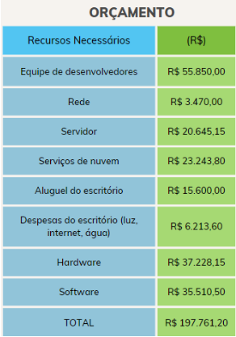

# Especificações do Projeto

## Personas

Pedro Paulo tem 26 anos, é arquiteto recém-formado e autônomo. Pensa em se desenvolver profissionalmente através de um mestrado fora do país, pois adora viajar, é solteiro e sempre quis fazer um intercâmbio. Está buscando uma agência que o ajude a encontrar universidades na Europa que aceitem alunos estrangeiros.

Enumere e detalhe as personas da sua solução. Para tanto, baseie-se tanto nos documentos disponibilizados na disciplina e/ou nos seguintes links:

> **Links Úteis**:
> - [Rock Content](https://rockcontent.com/blog/personas/)
> - [Hotmart](https://blog.hotmart.com/pt-br/como-criar-persona-negocio/)
> - [O que é persona?](https://resultadosdigitais.com.br/blog/persona-o-que-e/)
> - [Persona x Público-alvo](https://flammo.com.br/blog/persona-e-publico-alvo-qual-a-diferenca/)
> - [Mapa de Empatia](https://resultadosdigitais.com.br/blog/mapa-da-empatia/)
> - [Mapa de Stalkeholders](https://www.racecomunicacao.com.br/blog/como-fazer-o-mapeamento-de-stakeholders/)
>
Lembre-se que você deve ser enumerar e descrever precisamente e personalizada todos os clientes ideais que sua solução almeja.

## Histórias de Usuários

Com base na análise das personas forma identificadas as seguintes histórias de usuários:

|EU COMO... `PERSONA`| QUERO/PRECISO ... `FUNCIONALIDADE` |PARA ... `MOTIVO/VALOR`                 |
|--------------------|------------------------------------|----------------------------------------|
|Usuário do sistema  | Registrar minhas tarefas           | Não esquecer de fazê-las               |
|Administrador       | Alterar permissões                 | Permitir que possam administrar contas |

Apresente aqui as histórias de usuário que são relevantes para o projeto de sua solução. As Histórias de Usuário consistem em uma ferramenta poderosa para a compreensão e elicitação dos requisitos funcionais e não funcionais da sua aplicação. Se possível, agrupe as histórias de usuário por contexto, para facilitar consultas recorrentes à essa parte do documento.

> **Links Úteis**:
> - [Histórias de usuários com exemplos e template](https://www.atlassian.com/br/agile/project-management/user-stories)
> - [Como escrever boas histórias de usuário (User Stories)](https://medium.com/vertice/como-escrever-boas-users-stories-hist%C3%B3rias-de-usu%C3%A1rios-b29c75043fac)
> - [User Stories: requisitos que humanos entendem](https://www.luiztools.com.br/post/user-stories-descricao-de-requisitos-que-humanos-entendem/)
> - [Histórias de Usuários: mais exemplos](https://www.reqview.com/doc/user-stories-example.html)
> - [9 Common User Story Mistakes](https://airfocus.com/blog/user-story-mistakes/)

## Modelagem do Processo de Negócio 

### Análise da Situação Atual

Apresente aqui os problemas existentes que viabilizam sua proposta. Apresente o modelo do sistema como ele funciona hoje. Caso sua proposta seja inovadora e não existam processos claramente definidos, apresente como as tarefas que o seu sistema pretende implementar são executadas atualmente, mesmo que não se utilize tecnologia computacional. 

### Descrição Geral da Proposta

Apresente aqui uma descrição da sua proposta abordando seus limites e suas ligações com as estratégias e objetivos do negócio. Apresente aqui as oportunidades de melhorias.

### Processo 1 – NOME DO PROCESSO

Apresente aqui o nome e as oportunidades de melhorias para o processo 1. Em seguida, apresente o modelo do processo 1, descrito no padrão BPMN. 

### Processo 2 – NOME DO PROCESSO

Apresente aqui o nome e as oportunidades de melhorias para o processo 2. Em seguida, apresente o modelo do processo 2, descrito no padrão BPMN.

## Indicadores de Desempenho

Apresente aqui os principais indicadores de desempenho e algumas metas para o processo. Atenção: as informações necessárias para gerar os indicadores devem estar contempladas no diagrama de classe. Colocar no mínimo 5 indicadores. 

Usar o seguinte modelo: 

Obs.: todas as informações para gerar os indicadores devem estar no diagrama de classe a ser apresentado a posteriori. 

## Requisitos

As tabelas que se seguem apresentam os requisitos funcionais e não funcionais que detalham o escopo do projeto. Os requisitos funcionais de um sistema descrevem o que ele deve fazer, correspondem a uma funcionalidade que deve estar presente na plataforma. Já os requisitos não funcionais de um sistema descrevem como ele deve fazer, correspondem a uma característica técnica, seja de usabilidade, desempenho, confiabilidade, segurança ou outro.

### Requisitos Funcionais

|ID    | Descrição do Requisito  | Prioridade |
|------|-----------------------------------------|----|
|RF-001| O sistema deve permitir o acesso às funcionalidades apenas para pessoas que possuam usuário e senha.  | Alta |
|RF-002| O sistema deve permitir que um usuário se cadastre. | Alta | 
|RF-003| O sistema deve permitir que um usuário recupere sua senha   | Alta |
|RF-004| O sistema deve permitir que um usuário cadastrado atualize seus dados.   | Média |
|RF-005| O sistema deve cadastrar, atualizar, excluir e buscar grupos de despesa.   | Alta |
|RF-006| O sistema deve cadastrar, atualizar, excluir e buscar grupos de receita.   | Alta |
|RF-007| Deve ser capaz de exibir as receitas e despesas mensais do usuário.   | Alta |

### Requisitos não Funcionais

|ID     | Descrição do Requisito  |Prioridade |
|-------|-------------------------|----|
|RNF-001| Não é permitido existir usuários duplicados no sistema.| Alta | 
|RNF-002| Toda operação de consulta no sistema não deve ultrapassar 5 segundos. |  Média | 
|RNF-003| Toda operação de inserção no sistema não deve ultrapassar 5 segundos. |  Média | 
|RNF-004| A senha deve conter no mínimo 6 e no máximo 10 caracteres incluindo, letra maiúscula, minúscula e número.  |  Alta | 
|RNF-005| O sistema deverá manter o funcionamento de 96% do tempo em 24hrs por dia, dos 7 dias da semana. |  Média | 

## Restrições

O projeto está restrito pelos itens apresentados na tabela a seguir.

|ID| Restrição                                             |
|--|-------------------------------------------------------|
|01| O projeto deverá ser entregue até o final do semestre |
|02| Não pode ser desenvolvido um módulo de backend        |

Enumere as restrições à sua solução. Lembre-se de que as restrições geralmente limitam a solução candidata.

> **Links Úteis**:
> - [O que são Requisitos Funcionais e Requisitos Não Funcionais?](https://codificar.com.br/requisitos-funcionais-nao-funcionais/)
> - [O que são requisitos funcionais e requisitos não funcionais?](https://analisederequisitos.com.br/requisitos-funcionais-e-requisitos-nao-funcionais-o-que-sao/)

## Diagrama de Casos de Uso

O diagrama de casos de uso é o próximo passo após a elicitação de requisitos, que utiliza um modelo gráfico e uma tabela com as descrições sucintas dos casos de uso e dos atores. Ele contempla a fronteira do sistema e o detalhamento dos requisitos funcionais com a indicação dos atores, casos de uso e seus relacionamentos. 

As referências abaixo irão auxiliá-lo na geração do artefato “Diagrama de Casos de Uso”.

> **Links Úteis**:
> - [Criando Casos de Uso](https://www.ibm.com/docs/pt-br/elm/6.0?topic=requirements-creating-use-cases)
> - [Como Criar Diagrama de Caso de Uso: Tutorial Passo a Passo](https://gitmind.com/pt/fazer-diagrama-de-caso-uso.html/)
> - [Lucidchart](https://www.lucidchart.com/)
> - [Astah](https://astah.net/)
> - [Diagrams](https://app.diagrams.net/)

# Matriz de Rastreabilidade

Uma matriz de rastreabilidade nada mais é do que uma forma de visualização do relacionamento entre os requisitos. Por meio dela, são listados os requisitos nas linhas e nas colunas da matriz, depois se aplica um X nas células correspondentes, caracterizando os relacionamentos entre os requisitos. Dessa forma, podemos utilizar para efeitos de ilustração, um sistema com sete requisitos. 

Davis (1993) classifica as informações de rastreabilidade, inicialmente, em quatro tipos: 

* Rastreabilidade backward-from: é a ligação entre os requisitos e as suas origens com outros documentos ou pessoas. 

* Rastreabilidade forward-from: a ligação entre os requisitos, o projeto e os componentes da implementação. 

* Rastreabilidade backward-to: a ligação entre o projeto, os componentes de implementação e os requisitos. 

* Rastreabilidade forward-to: a ligação de outros documentos com os requisitos relevantes

# Gerenciamento de Projeto

De acordo com o PMBoK v6 as dez áreas que constituem os pilares para gerenciar projetos, e que caracterizam a multidisciplinaridade envolvida, são: Integração, Escopo, Cronograma (Tempo), Custos, Qualidade, Recursos, Comunicações, Riscos, Aquisições, Partes Interessadas. Para desenvolver projetos um profissional deve se preocupar em gerenciar todas essas dez áreas. Elas se complementam e se relacionam, de tal forma que não se deve apenas examinar uma área de forma estanque. É preciso considerar, por exemplo, que as áreas de Escopo, Cronograma e Custos estão muito relacionadas. Assim, se eu amplio o escopo de um projeto eu posso afetar seu cronograma e seus custos.

## Gerenciamento de Tempo

O gráfico de Gantt é uma ferramenta de gerenciamento de projetos que exibe visualmente as atividades do projeto ao longo do tempo, ele ajuda os gerentes de projeto a visualizar o cronograma do projeto, identificar possíveis problemas e ajustar o plano do projeto, se necessário. Ele também permite que as equipes trabalhem de forma mais eficiente, fornecendo uma visão geral do progresso do projeto e das tarefas pendentes. 

 Trazendo para nosso contexto de aplicativo móvel de controle financeiro, o gráfico de Gantt é uma representação gráfica das atividades envolvidas no desenvolvimento do aplicativo, mostrando as datas de início e término previstas para cada atividade. 

Para esse fim, construímos o gráfico de Gantt conforme disposto na figura 3. Ele contém uma lista de tarefas ou atividades na vertical e um eixo horizontal que representa o tempo. As barras horizontais representam a duração de cada atividade e a posição das barras no eixo do tempo indica quando cada atividade deve começar e terminar.

## Gerenciamento de Equipe

O gerenciamento adequado de tarefas contribuirá para que o projeto alcance altos níveis de produtividade. Por isso, é fundamental que ocorra a gestão de tarefas e de pessoas, de modo que os times envolvidos no projeto possam ser facilmente gerenciados. 

## Gestão de Orçamento

O processo de determinar o orçamento do projeto é uma tarefa que depende, além dos produtos (saídas) dos processos anteriores do gerenciamento de custos, também de produtos oferecidos por outros processos de gerenciamento, como o escopo e o tempo.

