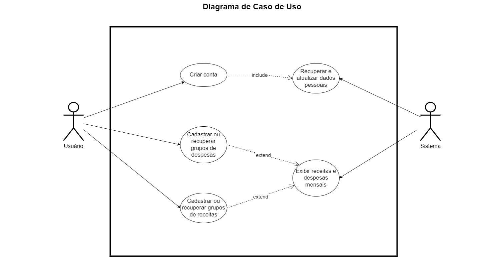

# Especificações do Projeto

## Personas

|Diego Lopes|  |
|-----------------------|-|
|Idade:|35|
|Ocupação:| Influencer digital |
|Aplicativos:| WhatsApp, Facebook, Instagram, LinkedIn, Aplicativos de bancos, Spotify    |
|Motivações | Economizar dinheiro para realizar novas viagens no futuro. Ter uma visão clara das finanças para poder desfrutar melhor as viagens sem se preocupar com gastos excessivos.   |
|Frustrações | Gastar mais do que o esperado durante as viagens e ter que adiar novos planos de viagem. Não conseguir aproveitar bem as viagens por estar sempre preocupado com os gastos. |
|Hobbies | Gosta de ler, Ouvir música |

|Melissa Soares|  |
|-----------------------|-|
|Idade:|56|
|Ocupação:| Publicitária em uma agência em período integral |
|Aplicativos:| WhatsApp, Facebook, Instagram |
|Motivações | Gostaria de morar em outro país para conhecer novas culturas, Seus filhos são seu tesouro   |
|Frustrações | Gostaria de trocar seu aparelho, mas não sabe aonde vender |
|Hobbies | Gosta de cuidar de suas plantas, Faz natação |

|Lucas Simão|  |
|-----------------------|-|
|Idade:|15|
|Ocupação:| Estudante do ensino médio |
|Aplicativos:| WhatsApp, Facebook, Instagram, LinkedIn, Aplicativos de bancos, Spotify    |
|Motivações | Espera um dia ser jogador profissional de free fire, Encontrar seus amigos a noite para conversas divertidas  |
|Frustrações | Por jogar tanto no celular, a bateria acaba sendo prejudicada e por esse motivo ele sempre precisa comprar um aparelho novo, gastando muito dinheiro sempre |
|Hobbies | Andar de skate , Assistir TV  |

|Elisa Andrade|  |
|-----------------------|-|
|Idade:|75|
|Ocupação:| Dona de casa, aposentada. Criou seus 2 filhos e agora curte seus netos e seu jardim |
|Aplicativos:| WhatsApp |
|Motivações | Seus netos são muito preciosos para ela, Encontrar alguns amigos para jogar xadrez |
|Frustrações | Por seus netos não morarem na mesma cidade, só conseguem se falar por vídeo chamada, Gostaria de trocar de celular para obter um com uma câmera melhor |
|Hobbies | Gosta de ler, Jogar Xadrez |

|Sergio Souza |  |
|-----------------------|-|
|Idade:|55|
|Ocupação:| Analista de compras em uma startup que assessora vendas de roupa em atacado |
|Aplicativos:| WhatsApp, Facebook |
|Motivações |  Viajar ao mundo com sua esposa e conhecer novas culturas  |
|Frustrações | Sua empresa precisa diminuir custos com despesas de celulares corporativos para seus funcionários |
|Hobbies | Academia, Jogar tênis |

## Histórias de Usuários

Com base na análise das personas forma identificadas as seguintes histórias de usuários:

|EU COMO... `PERSONA`| QUERO/PRECISO ... `FUNCIONALIDADE`         |PARA ... `MOTIVO/VALOR`                               |
|--------------------|--------------------------------------------|------------------------------------------------------|
|Diego Lopes         |Um celular de ponta                         |Para gravar vídeos e tirar fotos com qualidades       |
|Melissa Soares      |Trocar o celular                            |Não tem um motivo específico, só quer trocar de modelo|
|Lucas Simão         |Trocar o celular para o mesmo modelo        |A bateria estar ruim e não conseguir mais jogar nele  |
|Elisa Andrade       |Trocar o celular para um modelo mais recente|Para obter um celular com uma câmera melhor           |
|Sergio Souza        |Comprar celulares com baixo custo           |Para diminuir o custo de sua empresa                  |

## Modelagem do Processo de Negócio 

### Análise da Situação Atual

Apresente aqui os problemas existentes que viabilizam sua proposta. Apresente o modelo do sistema como ele funciona hoje. Caso sua proposta seja inovadora e não existam processos claramente definidos, apresente como as tarefas que o seu sistema pretende implementar são executadas atualmente, mesmo que não se utilize tecnologia computacional. 

### Descrição Geral da Proposta

Apresente aqui uma descrição da sua proposta abordando seus limites e suas ligações com as estratégias e objetivos do negócio. Apresente aqui as oportunidades de melhorias.

### Processo 1 – NOME DO PROCESSO

Apresente aqui o nome e as oportunidades de melhorias para o processo 1. Em seguida, apresente o modelo do processo 1, descrito no padrão BPMN. 

### Processo 2 – NOME DO PROCESSO

Apresente aqui o nome e as oportunidades de melhorias para o processo 2. Em seguida, apresente o modelo do processo 2, descrito no padrão BPMN.

## Indicadores de Desempenho

Apresente aqui os principais indicadores de desempenho e algumas metas para o processo. Atenção: as informações necessárias para gerar os indicadores devem estar contempladas no diagrama de classe. Colocar no mínimo 5 indicadores. 

Usar o seguinte modelo: 

Obs.: todas as informações para gerar os indicadores devem estar no diagrama de classe a ser apresentado a posteriori. 

## Requisitos

As tabelas que se seguem apresentam os requisitos funcionais e não funcionais que detalham o escopo do projeto. Os requisitos funcionais de um sistema descrevem o que ele deve fazer, correspondem a uma funcionalidade que deve estar presente na plataforma. Já os requisitos não funcionais de um sistema descrevem como ele deve fazer, correspondem a uma característica técnica, seja de usabilidade, desempenho, confiabilidade, segurança ou outro.

### Requisitos Funcionais

|ID    | Descrição do Requisito  | Prioridade |
|------|-----------------------------------------|----|
|RF-001| O sistema deve permitir o acesso às funcionalidades apenas para pessoas que possuam usuário e senha.  | Alta |
|RF-002| O sistema deve permitir que um usuário se cadastre. | Alta | 
|RF-003| O sistema deve permitir que um usuário recupere sua senha   | Alta |
|RF-004| O sistema deve permitir que um usuário cadastrado atualize seus dados.   | Média |
|RF-005| O sistema deve cadastrar, atualizar, excluir e buscar grupos de despesa.   | Alta |
|RF-006| O sistema deve cadastrar, atualizar, excluir e buscar grupos de receita.   | Alta |
|RF-007| Deve ser capaz de exibir as receitas e despesas mensais do usuário.   | Alta |

### Requisitos não Funcionais

|ID     | Descrição do Requisito  |Prioridade |
|-------|-------------------------|----|
|RNF-001| Não é permitido existir usuários duplicados no sistema.| Alta | 
|RNF-002| Toda operação de consulta no sistema não deve ultrapassar 5 segundos. |  Média | 
|RNF-003| Toda operação de inserção no sistema não deve ultrapassar 5 segundos. |  Média | 
|RNF-004| A senha deve conter no mínimo 6 e no máximo 10 caracteres incluindo, letra maiúscula, minúscula e número.  |  Alta | 
|RNF-005| O sistema deverá manter o funcionamento de 96% do tempo em 24hrs por dia, dos 7 dias da semana. |  Média | 

## Restrições

O projeto está restrito pelos itens apresentados na tabela a seguir.

|ID| Restrição                                             |
|--|-------------------------------------------------------|
|01| A primeira etapa do projeto referente a concepção e proposta de solução deverá ser entregue até o dia 05/03/2023. |
|02| A segunda etapa do projeto referente ao projeto da solução deverá ser entregue até o dia 02/04/2023.       |
|03| A terceira etapa do projeto referente a 1ª fase do desenvolvimento da solução deverá ser entregue até o dia 07/05/2023.        |
|04| A quarta etapa do projeto referente a 2ª fase do desenvolvimento da solução deverá ser entregue até o dia 04/06/2023.     |
|05| A quinta etapa do projeto referente aos relatórios das avaliações e entrega da solução deverá ser entregue até o dia 23/06/2023.      |
|06| O sistema deve ser construído utilizando o React Native .      |
|07| Não pode ser desenvolvido um módulo de backend.        |

## Diagrama de Casos de Uso

O diagrama de casos de uso é o próximo passo após a elicitação de requisitos, que utiliza um modelo gráfico e uma tabela com as descrições sucintas dos casos de uso e dos atores. Ele contempla a fronteira do sistema e o detalhamento dos requisitos funcionais com a indicação dos atores, casos de uso e seus relacionamentos. 

# Matriz de Rastreabilidade

Uma matriz de rastreabilidade nada mais é do que uma forma de visualização do relacionamento entre os requisitos. Por meio dela, são listados os requisitos nas linhas e nas colunas da matriz, depois se aplica um X nas células correspondentes, caracterizando os relacionamentos entre os requisitos. Dessa forma, podemos utilizar para efeitos de ilustração, um sistema com sete requisitos. 

Davis (1993) classifica as informações de rastreabilidade, inicialmente, em quatro tipos: 

* Rastreabilidade backward-from: é a ligação entre os requisitos e as suas origens com outros documentos ou pessoas. 

* Rastreabilidade forward-from: a ligação entre os requisitos, o projeto e os componentes da implementação. 

* Rastreabilidade backward-to: a ligação entre o projeto, os componentes de implementação e os requisitos. 

* Rastreabilidade forward-to: a ligação de outros documentos com os requisitos relevantes

# Gerenciamento de Projeto

De acordo com o PMBoK v6 as dez áreas que constituem os pilares para gerenciar projetos, e que caracterizam a multidisciplinaridade envolvida, são: Integração, Escopo, Cronograma (Tempo), Custos, Qualidade, Recursos, Comunicações, Riscos, Aquisições, Partes Interessadas. Para desenvolver projetos um profissional deve se preocupar em gerenciar todas essas dez áreas. Elas se complementam e se relacionam, de tal forma que não se deve apenas examinar uma área de forma estanque. É preciso considerar, por exemplo, que as áreas de Escopo, Cronograma e Custos estão muito relacionadas. Assim, se eu amplio o escopo de um projeto eu posso afetar seu cronograma e seus custos.

## Gerenciamento de Tempo

O gráfico de Gantt é uma ferramenta de gerenciamento de projetos que exibe visualmente as atividades do projeto ao longo do tempo, ele ajuda os gerentes de projeto a visualizar o cronograma do projeto, identificar possíveis problemas e ajustar o plano do projeto, se necessário. Ele também permite que as equipes trabalhem de forma mais eficiente, fornecendo uma visão geral do progresso do projeto e das tarefas pendentes. 

 Trazendo para nosso contexto de aplicativo móvel de controle financeiro, o gráfico de Gantt é uma representação gráfica das atividades envolvidas no desenvolvimento do aplicativo, mostrando as datas de início e término previstas para cada atividade. 

Para esse fim, construímos o gráfico de Gantt conforme disposto na figura 3. Ele contém uma lista de tarefas ou atividades na vertical e um eixo horizontal que representa o tempo. As barras horizontais representam a duração de cada atividade e a posição das barras no eixo do tempo indica quando cada atividade deve começar e terminar.

## Gerenciamento de Equipe

O gerenciamento adequado de tarefas contribuirá para que o projeto alcance altos níveis de produtividade. Por isso, é fundamental que ocorra a gestão de tarefas e de pessoas, de modo que os times envolvidos no projeto possam ser facilmente gerenciados. 

## Gestão de Orçamento

O processo de determinar o orçamento do projeto é uma tarefa que depende, além dos produtos (saídas) dos processos anteriores do gerenciamento de custos, também de produtos oferecidos por outros processos de gerenciamento, como o escopo e o tempo.

